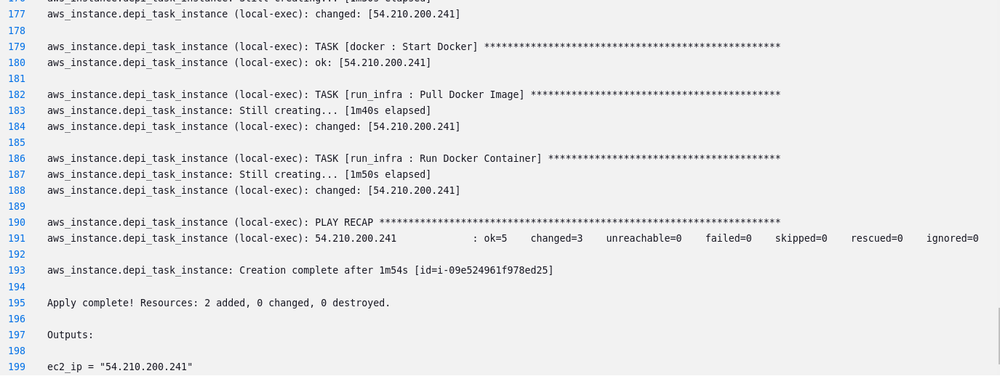
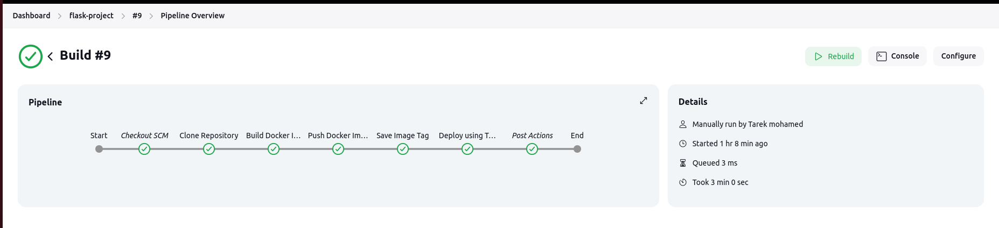
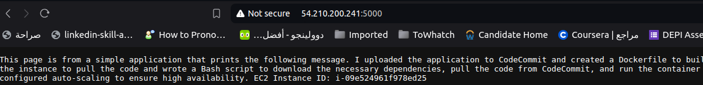
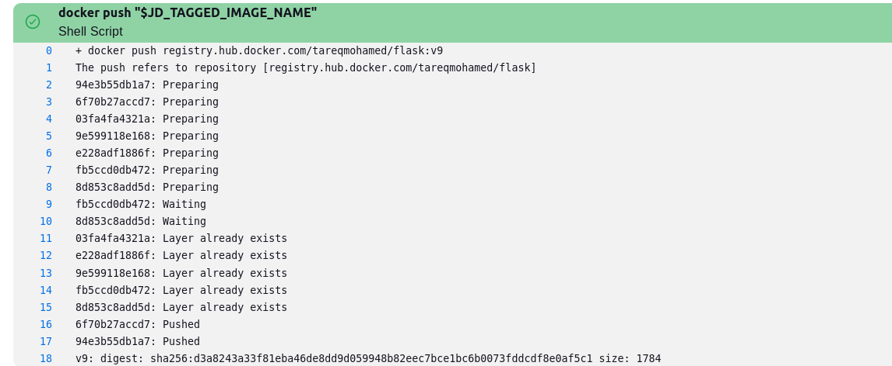
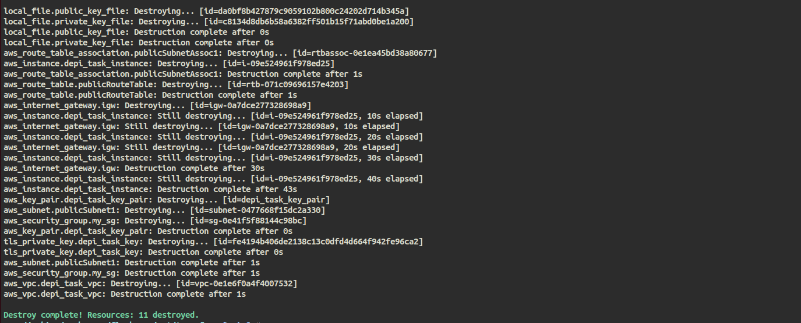

# End-to-End DevOps Flask Project

## Description

This project demonstrates an end-to-end DevOps setup for deploying a Flask application on AWS using Terraform and Ansible. It automates the process of creating the necessary AWS infrastructure and deploying a containerized Flask application.

## Table of Contents

- [Prerequisites](#prerequisites)
- [Project Structure](#project-structure)
- [Installation](#installation)
- [Usage](#usage)
- [Infrastructure Details](#infrastructure-details)
- [Configuration](#configuration)
- [Ansible Roles](#ansible-roles)
- [Deployment Options](#deployment-options)
- [Using Jenkins](#using-jenkins)
- [Output](#output)
- [Contributing](#contributing)
- [License](#license)

## Prerequisites

Before you begin, ensure you have the following installed:

- Terraform
- Ansible
- AWS CLI (configured with appropriate credentials)
- Docker (for the Flask application image)
- Jenkins (optional for CI/CD)

## Project Structure

```
.
├── terraform/
│   ├── ec2.tf
│   ├── networks.tf
│   ├── output.tf
│   ├── provider.tf
│   ├── variables.tf
│   └── keys/
│       ├── depi_task_private_key.pem
│       └── depi_task_public_key.pub
├── ansible/
│   ├── inventory.ini
│   ├── playbook.yaml
│   └── roles/
│       ├── docker/
│       │   └── tasks/
│       │       └── main.yml
│       └── run_infra/
│           └── tasks/
│               └── main.yml
├── jenkins/
│   └── Jenkinsfile
├── app.py
└── Dockerfile
```

## Installation

1. Clone the repository:
   ```bash
   git clone https://github.com/Tareqmohamed/end-to-end-devops-flask-project.git
   cd end-to-end-flask-devops
   ```

2. Initialize Terraform:
   ```bash
   cd terraform
   terraform init
   ```

## Usage

1. Review and modify the `variables.tf` file to adjust any default values if needed.

2. Plan the Terraform execution:
   ```bash
   terraform plan
   ```

3. Apply the Terraform configuration:
   ```bash
   terraform apply
   ```

4. After the infrastructure is created, Terraform will automatically trigger the Ansible playbook to deploy the Flask application.

5. Once the deployment is complete, you can access the Flask application using the EC2 instance's public IP address, which will be displayed in the Terraform output.

## Infrastructure Details

This project sets up the following AWS resources:

- VPC with CIDR block 10.0.0.0/16
- Public subnet in us-east-1a
- Internet Gateway
- Route Table for public access
- Security Group allowing inbound traffic on ports 22, 80, and 5000
- EC2 instance (t3.micro) running the Flask application
- Key Pair for SSH access

## Configuration

You can customize the deployment by modifying the following files:

- `variables.tf`: Adjust default values for region, VPC CIDR, subnet CIDR, instance type, etc.
- `ec2.tf`: Modify the EC2 instance configuration or add additional resources.
- `networks.tf`: Adjust network settings, add more subnets, or modify security group rules.
- `ansible/playbook.yaml`: Update the Ansible playbook to change the application deployment process.

## Ansible Roles

This project uses Ansible roles to organize and structure the deployment tasks. The main roles are:

### Docker Role

The Docker role is responsible for installing and configuring Docker on the EC2 instance. It performs the following tasks:

1. Updates the apt cache
2. Installs required packages for Docker
3. Adds Docker's official GPG key
4. Sets up the Docker repository
5. Installs Docker Engine
6. Starts and enables the Docker service
7. Installs Docker Compose

### Run Infra Role

The Flask App role handles the deployment of the Flask application. It includes the following tasks:

1. Pulls the specified Docker image for the Flask application
2. Runs the Docker container with the Flask application
3. Configures the container to restart automatically
4. Maps the container's port to the host machine

These roles ensure a clean separation of concerns and make the playbook more maintainable and reusable.

## Deployment Options

There are two options to run this project:

1. **Directly Using Terraform:**  
   You can run the project directly by executing the Terraform commands. When you apply the Terraform configuration, it will automatically run the Ansible playbook to configure the EC2 instance.

   ```bash
   terraform apply
   ```

2. **Using Jenkins for CI/CD:**  
   Alternatively, you can use Jenkins to automate the CI/CD pipeline. Here's how to set it up:

   ### Using Jenkins

   - **Set Up Jenkins:**
     1. Install Jenkins and ensure it's running.
     2. Configure Jenkins with Docker support and set up your Jenkins agent.

   - **Create a New Pipeline Job:**
     1. In Jenkins, create a new pipeline job.
     2. Set the pipeline definition to use the `Jenkinsfile` stored in your GitHub repository.

   - **Configure GitHub Hook:**
     1. Set up a GitHub webhook to trigger Jenkins on new commits to the repository.

   - **Pipeline Execution:**
     1. The Jenkins pipeline will handle the following steps:
        - Clone the repository from GitHub.
        - Build the Docker image for the Flask application.
        - Push the Docker image to Docker Hub.
        - Run Terraform to provision the infrastructure and trigger Ansible for deployment.

   - **View Output:**
     1. After the pipeline execution, check the Jenkins job output for logs or errors.
     2. Access the Flask application using the EC2 instance's public IP address.

## Output

After successfully running the project, you can expect the following outputs:

### 1. **Terraform Output:**
   Once the `terraform apply` command completes, Terraform will display the public IP address of the EC2 instance where the Flask application is running. You can access the application by visiting `http://<EC2-Public-IP>:5000`.

   **Screenshot:**
   Below is a screenshot of Terraform successfully applying the infrastructure and triggered ansible and showing the ansible output and ec2 public IP:
   
   

### 2. **Jenkins Pipeline Logs:**
   After the pipeline completes in Jenkins, you should see successful logs indicating the following stages:
   - Clone the repository from GitHub.
   - Build and push the Docker image to Docker Hub.
   - Provision the infrastructure using Terraform.
   - Deploy the Flask application using Ansible.

   **Screenshot:**
   Here's a screenshot of the successful Jenkins pipeline execution:
   
   

### 3. **Flask Application Running:**
   Once the application is deployed, you should be able to access it in your browser at `http://<EC2-Public-IP>:5000`. The Flask application should display a message confirming it's up and running.

   **Screenshot:**
   Here’s a screenshot of the running Flask application in the browser:
   
   

### 4. **Docker Hub Image:**
   You can verify the Flask Docker image has been pushed to Docker Hub by logging in to Docker Hub and checking your repository.

   **Screenshot:**
   Below is a screenshot of the Flask image in your Docker Hub repository:
   
   

### 5. **Terraform Destroy (Optional):**
   If you choose to tear down the infrastructure after testing, you can run `terraform destroy` to remove all resources. Terraform will show confirmation that all resources have been deleted.

   **Screenshot:**
   You can add a screenshot of Terraform successfully destroying the infrastructure:
   
   

## Contributing

Contributions to this project are welcome. Please follow these steps:

1. Fork the repository
2. Create a new branch (`git checkout -b feature/your-feature-name`)
3. Make your changes and commit them (`git commit -am 'Add some feature'`)
4. Push to the branch (`git push origin feature/your-feature-name`)
5. Create a new Pull Request

## License

This project is licensed under the MIT License. See the [LICENSE](LICENSE) file for details.

